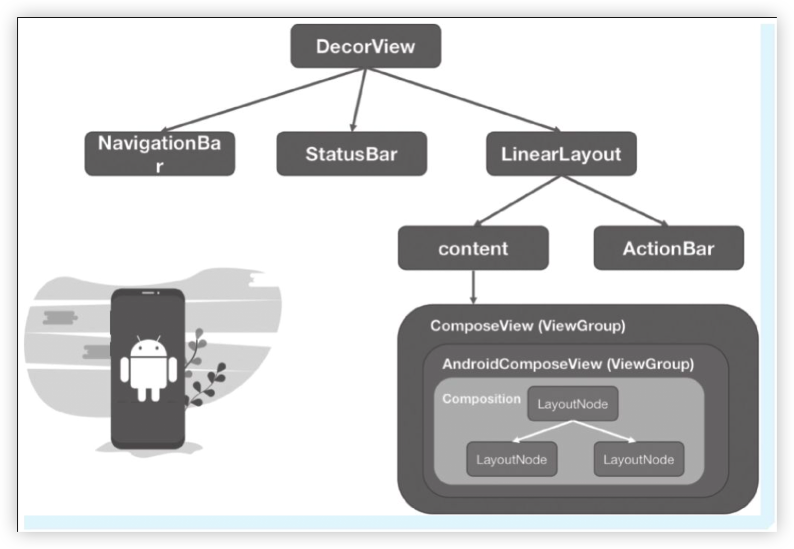

> [Google教程](https://developer.android.com/jetpack/compose/setup?hl=zh-cn#bom-version-mapping)
> 
> [BoM 物料清单](https://developer.android.com/jetpack/compose/bom/bom?hl=zh-cn)
> 
> [Kotlin 预发布版本兼容的 Compose Compiler 版本](https://developer.android.com/jetpack/androidx/releases/compose-kotlin?hl=zh-cn)
> 
> 

# Compose UI 布局结构

